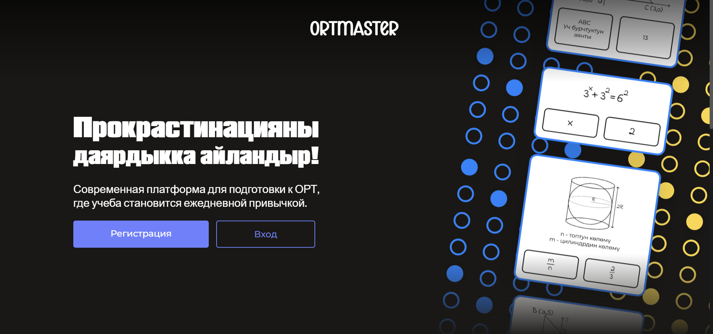
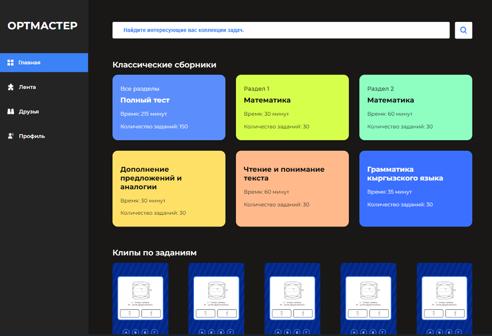

<!-- Баннер проекта -->


# ОРТмастер 📝
**ОРТмастер** — образовательная платформа для подготовки к экзаменам с тестами, геймификацией и AI-помощником.  
Цель проекта — повысить эффективность подготовки через интерактивные задания и анализ прогресса.

---

## 🚀 Основные возможности
- Создание и прохождение тестов с автоматической проверкой  
- Геймификация обучения: баллы, уровни и достижения  
- AI-помощник для подсказок и анализа ошибок  
- Социальные функции: профили, лидерборды, чаты  
- Генерация детальных отчётов о прогрессе  
- Мультиплатформенность: веб и мобильная версия

---

## 🛠 Технологии
**Фронтенд:** React, TypeScript, Mantine, React Hook Form, Zustand, Axios  
**Бэкенд:** Java, Spring Boot  
**База данных:** PostgreSQL / MongoDB  
**Хостинг:** AWS / VPS, развёртывание через Docker  

---

## 📸 Скриншоты



---

## ⚡ Быстрый старт
```bash
git clone https://github.com/твой-репозиторий.git
npm install
npm run dev

cd ../backend
./mvnw spring-boot:run
